# MARKETIVITY — FINAL LAUNCH READINESS AUDIT

## Source-Based Launch Audit & Pre-Deployment Checklist

---

### 1. Executive Summary

| Category | Readiness | Current State | Critical Blockers (P0) |
|---|---|---|---|
| **Technical Codebase** | 98% | Next.js 16 + React 19, Turbopack, 0 build errors across 34 routes | 0 code bugs |
| **Bilingual Localization** | 100% | Full 1:1 key parity between English (`/en`) & Bengali (`/bn`) with natural human copy | None |
| **Mobile UX** | 95% | 375px/390px/412px responsive layouts, touch targets ≥ 44px, zero horizontal overflow | None |
| **Contact Backend** | 85% | Resend API route with in-memory rate-limiting, sanitization, auto-responder | Domain verification on Resend |
| **Real Business Data** | 70% | Core contact details present; case studies, testimonials & team photos need client sign-off | Client permissions & photos |
| **SEO & Social Meta** | 60% | Basic title/description present; OpenGraph, Sitemap, Robots, MetadataBase missing | Production domain & OG image |
| **Legal & Compliance** | 30% | Privacy policy & terms routes not yet created | Privacy Policy & Terms pages |

---

### 2. Business Information Audit

| Field | Current Code Value | Source File | Launch Status |
|---|---|---|---|
| **Agency Name** | Marketivity / মার্কেটিভিটি | `messages/en.json`, `messages/bn.json` | ✅ Verified |
| **Tagline** | Digital Growth Partners / ডিজিটাল গ্রোথ পার্টনার | `messages/en.json`, `messages/bn.json` | ✅ Verified |
| **Office Address** | Padma R/A, Chandrima, Rajshahi, Bangladesh | `Footer.tsx`, `contact/page.tsx` | ⚠️ Needs user confirmation |
| **Primary Phone** | 01767644696 | `Footer.tsx`, `contact/page.tsx` | ⚠️ Needs user confirmation |
| **Primary Email** | `marketivitybd@gmail.com` | `Footer.tsx`, `route.ts`, `.env.local` | ⚠️ Free Gmail — custom domain email recommended |
| **WhatsApp Link** | `https://wa.me/8801767644696` | `WhatsAppFloat.tsx`, `Header.tsx` | ⚠️ Needs user confirmation |
| **Facebook Page** | `https://facebook.com/marketivitybd` | `Footer.tsx`, `contact/page.tsx` | ⚠️ Needs confirmation if page is live |
| **Instagram Profile** | `https://instagram.com/marketivitybd` | `Footer.tsx`, `contact/page.tsx` | ⚠️ Needs confirmation if profile is live |
| **Production Domain** | `https://marketivitybd.com` (Unset) | Not configured in `metadataBase` | ❌ Missing production domain URL |

---

### 3. Client & Case Study Audit

| Client / Case Study | Field | Current Value | Source | Status |
|---|---|---|---|---|
| **Zara Fashion BD** | Industry / Location | Fashion & Retail · Dhaka | `src/lib/case-studies.ts` | ⚠️ Needs client permission |
| | Metrics | +522% Revenue, 2.3k → 18.5k followers | `src/lib/case-studies.ts` | ⚠️ Needs client verification |
| | Visuals | Emoji icon `👗` (no screenshot) | `src/lib/case-studies.ts` | 🟡 Placeholder (No real screenshots) |
| **Spice Garden Restaurant**| Industry / Location | Food & Beverage · Rajshahi | `src/lib/case-studies.ts` | ⚠️ Needs client permission |
| | Metrics | +625% Bookings (12 → 87/week), ৳145k/mo | `src/lib/case-studies.ts` | ⚠️ Needs client verification |
| | Visuals | Emoji icon `🍛` (no screenshot) | `src/lib/case-studies.ts` | 🟡 Placeholder (No real screenshots) |
| **EduPlex Academy** | Industry / Location | Education · Bogura | `src/lib/case-studies.ts` | ⚠️ Needs client permission |
| | Metrics | +6,900% Organic Traffic (Page 8 → Page 1) | `src/lib/case-studies.ts` | ⚠️ Needs client verification |
| | Visuals | Emoji icon `🎓` (no screenshot) | `src/lib/case-studies.ts` | 🟡 Placeholder (No real screenshots) |

---

### 4. Testimonials & Social Proof Audit

| Client Name | Review Quote | Rating | Stated Platform | Verification Status |
|---|---|---|---|---|
| **Rahim Uddin** | "Marketivity transformed our social media presence. Engagement tripled in 3 months!" | 5.0 ⭐ | "Facebook Recommended" | ⚠️ Needs confirmation from actual client |
| **Fatima Akter** | "Professional team, transparent reporting, and real results..." | 5.0 ⭐ | "Facebook Recommended" | ⚠️ Needs confirmation from actual client |
| **Karim Hassan** | "Their Facebook ads strategy brought us 200+ qualified leads..." | 5.0 ⭐ | "Facebook Recommended" | ⚠️ Needs confirmation from actual client |
| **Nusrat Jahan** | "From branding to content — Marketivity handled everything..." | 5.0 ⭐ | "Facebook Recommended" | ⚠️ Needs confirmation from actual client |

---

### 5. Global Statistics Audit

| Statistic Claim | Display Location | Source Code | Verification Status |
|---|---|---|---|
| **20+ Happy Clients** | Stats Marquee & About Page | `src/lib/stats.ts` | ⚠️ Needs user confirmation |
| **35+ Campaigns Launched** | Stats Marquee & About Page | `src/lib/stats.ts` | ⚠️ Needs user confirmation |
| **100% Facebook Recommended** | Hero Badge, Footer, Navbar | `src/components/ui/FacebookBadge.tsx` | ⚠️ Needs confirmation if badge is based on Meta rating |
| **Top 3 in Bangladesh** | Stats Marquee | `src/lib/stats.ts` | ⚠️ Needs internal source or contextual clarification |

---

### 6. Services & Pricing Page Audit

| Service Track | Display Price | Billing Type | Features Listed | Status |
|---|---|---|---|---|
| **SEO Services** | ৳15,000 | /month | Keyword research, Technical SEO, Local SEO, Reports | ⚠️ Confirm current retainer rate |
| **Social Media Marketing** | ৳12,000 | /month | Content calendar, FB/Insta management, Community | ⚠️ Confirm current retainer rate |
| **Paid Advertising** | ৳10,000 | /month | Meta Ads, Google Ads setup, Audience targeting | ⚠️ Confirm current retainer rate |
| **Content Marketing** | ৳10,000 | /month | Blog writing, Copywriting, Social media content | ⚠️ Confirm current retainer rate |
| **Branding & Identity** | ৳25,000 | /project | Logo design, Brand kit, Guidelines document | ⚠️ Confirm current project rate |

---

### 7. Contact Form & Email Pipeline Audit

| Pipeline Stage | Implementation | Source File | Status |
|---|---|---|---|
| **Frontend Form** | Controlled form, input validation, loading spinner, success state | `ContactForm.tsx` | ✅ Ready |
| **Rate Limiter** | In-memory IP tracking (max 5 requests per 10 mins) | `route.ts` | ✅ Ready |
| **Input Sanitization** | Length truncation, regex email validation, safe strings | `route.ts` | ✅ Ready |
| **Resend Integration** | Dual email: Team notification + Client auto-responder | `route.ts` | ✅ Ready |
| **Sender Address (`CONTACT_FROM_EMAIL`)** | Currently `onboarding@resend.dev` (Free dev tier) | `.env.local` | ⚠️ Must verify custom domain on Resend before launch |
| **Receiver Address (`CONTACT_TO_EMAIL`)** | `marketivitybd@gmail.com` | `.env.local` | ✅ Configured |

---

### 8. SEO, Metadata & Social Sharing Audit

| SEO Element | Current Status | Required Action | Priority |
|---|---|---|---|
| **Page Titles & Descriptions** | ✅ Fully localized in EN and BN | None | Completed |
| **MetadataBase** | ❌ Missing in `layout.tsx` | Add `metadataBase: new URL('https://marketivitybd.com')` | 🔴 P0 |
| **Open Graph (OG) Images** | ❌ Missing (`og-image.jpg` or `opengraph-image.tsx`) | Add branded 1200×630px social preview image | 🔴 P0 |
| **Twitter Card Metadata** | ❌ Missing `twitter: { card: 'summary_large_image' }` | Add to `layout.tsx` | 🟠 P1 |
| **Dynamic Sitemap (`sitemap.ts`)** | ❌ Missing | Create `src/app/sitemap.ts` mapping all 34 routes | 🔴 P0 |
| **Robots Rules (`robots.ts`)** | ❌ Missing | Create `src/app/robots.ts` with sitemap reference | 🔴 P0 |
| **Canonical URLs & Hreflang** | ⚠️ Handled partially by Next-Intl routing | Add explicit canonical and hreflang links | 🟠 P1 |
| **Schema.org Structured Data** | ❌ Missing (`LocalBusiness` / `MarketingAgency` JSON-LD) | Add JSON-LD script in root layout | 🟠 P1 |

---

### 9. Assets & Media Inventory

| Asset Name | Expected Path | Current File Status | Action Required |
|---|---|---|---|
| **Primary Logo** | `/logo/marketivity-logo.png` | ✅ Exists (63.8 KB) | Confirm high-res clarity |
| **Favicon** | `/src/app/favicon.ico` | ✅ Exists (25.9 KB) | Confirm branding match |
| **Blog Images (3)** | `/images/blog-*.png` | ✅ 3 Images exist (380KB–770KB) | Compress to WebP for faster mobile loading |
| **Team Photos (4)** | Unsplash Remote URLs | 🟡 Stock Unsplash photos | Replace with real team photos or illustrated avatars |
| **Open Graph Banner** | `/opengraph-image.png` | ❌ Missing | Create 1200×630px social banner |
| **Client Logos** | `/images/clients/` | ❌ None | Add real logos for clients upon permission |

---

### 10. Legal & Trust Compliance Audit

| Requirement | Current Status | Impact on Public Business Launch |
|---|---|---|
| **Privacy Policy (`/privacy`)** | ❌ Missing | 🔴 P0: Required by Meta Ads, Google Ads, and privacy compliance |
| **Terms of Service (`/terms`)** | ❌ Missing | 🟠 P1: Strongly recommended for agency retainers and client agreements |
| **Cookie Notice** | ⚠️ Not required initially (no tracking cookies set yet) | 🟢 P3: Add when Google Analytics / Meta Pixel is installed |

---

### 11. Security & Edge Case Audit

| Security & Resilience Check | Status | Verification Detail |
|---|---|---|
| **API Keys in Client Code** | ✅ Secure | No secrets exposed in client JS bundles |
| **Form Spam Protection** | ✅ Protected | IP rate limiting + field constraints in `api/contact` |
| **404 Not Found Page** | ✅ Implemented | `src/app/not-found.tsx` |
| **500 Error Boundary** | ⚠️ Needs `error.tsx` | Add `src/app/[locale]/error.tsx` for graceful recovery |
| **WebGL Fallback** | ✅ Protected | 3D Core uses CSS pulse fallback if WebGL fails |
| **Offscreen Rendering Pause** | ✅ Protected | 3D loop pauses when out of view via `IntersectionObserver` |

---

### 12. Priority Action Matrix

```mermaid
graph TD
    P0["🔴 P0: Blockers (Must fix before public traffic)"]
    P1["🟠 P1: Pre-Launch Polish (Do before ads/campaigns)"]
    P2["🟡 P2: Post-Launch (Week 1–2)"]
    
    P0 --> A1["Set MetadataBase & Add Sitemap.ts / Robots.ts"]
    P0 --> A2["Create Open Graph Preview Banner (1200x630)"]
    P0 --> A3["Add Privacy Policy & Terms of Service Pages"]
    P0 --> A4["Verify Resend Domain & Set Production Env Vars"]
    
    P1 --> B1["Confirm Real Business Phone, Email & WhatsApp Number"]
    P1 --> B2["Add Schema.org JSON-LD LocalBusiness Structured Data"]
    P1 --> B3["Add Global Error Boundary (error.tsx)"]
    P1 --> B4["Compress Blog Images to WebP format"]
    
    P2 --> C1["Replace Unsplash Team Photos with Real Photos"]
    P2 --> C2["Add Google Analytics 4 / Google Tag Manager"]
    P2 --> C3["Add Meta Pixel & Conversion API tracking"]
```

